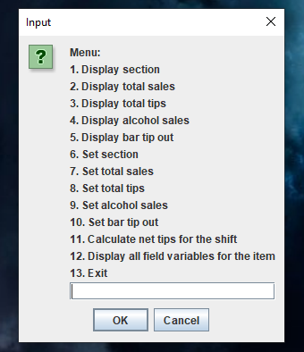
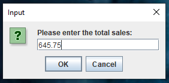
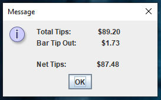
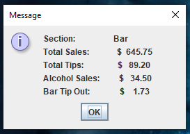

# shift-totals-calculator

-----------------------------------------------------------------------------

### Table of Contents
1. [Overview](#overview)
2. [Installation Instructions](#installation instructions)
3. [Usage Instructions](#usage instructions)
4. [FAQs](#faqs)
5. [Troubleshooting](#troubleshooting)
6. [Support](#suport)
7. [How to Contribute?](#how to contribute)
8. [License](#license)

### Overview
 This is a simple student-developed program developed to help create an overview for the data of a restaurant server's shift.  
 This program will also assist in calculating an optional bar tipout, as well as the net tips earned after the tipout.  
 Users will select an option in the menu, which will be to either input data, calculate a bar tipout or net tips earned, and display an overview of shift data.  
 The menu is very easy to navigate and use, and only requires simple inputs from the user to operate.  

 Here are some images of the menu in action:  
 
 **Main screen:**  
 
 
 **Input Example:**  
 
 
 **Net Tip Calculation Example:**  
 
 
 **Overview Screen Example:**  
 
 
### Installation Instructions
 A Java Runtime Environment installation is required, which can be found [here](https://www.java.com/en/download) or [here](https://www.oracle.com/java/technologies/javase-downloads.html). These links will contain any of the information you need to download Java for your operating system.

To extract the files you will need a **file archiver** such as [WinRAR](https://www.rarlab.com/download.htm) or [Zip](https://www.7-zip.org/download.html).  
*Newer versions of Windows and MacOS also allow ZIP file extraction through their respective file explorers.*

 1. Download the Program  
  The application can be downloaded as a ZIP file using [this link.](https://github.com/nichollsma/shift-totals-calculator/archive/master.zip)  
  *The downloaded file includes everything you need to run the application.*
 
 2. Extract Files 
  Open the ZIP file using one of the programs or methods mentioned above, then extract the files to a destination folder of your choice.
  
 3. Run the Application  
  To use the application, simply double click the jar file located within the files you extracted during the previous step and the menu will display.
  
*Voila!* You have now installed the shift totals calculator program and are ready to use it at any time.
 
### Usage Instructions
 
### FAQs

Q: 

A:

Q:

A:

Q:

A:

Q:

A:
 
### Troubleshooting
 
 * If you have any problems downloading the file or the programs mentioned in the [installation instructions](#installation instructoins) section, try refreshing the page or reconnecting to the internet before reattempting to download
 * If the download links for Java as well as WinRAR and 7Zip are broken or lead to an error page, the products can easily be found on a search engine.
 * If you have problems opening the ZIP file with your OS's file explorer, try using one of the programs mentioned in the [installation instructions](#installation instructoins) section
 * If you have problems using either WinRAR or 7Zip, try reinstalling or updating your program, and if the problem persists try using the other program mentioned
 * If the jar file does not run, try renstalling or updating your Java installation as well as restarting your computer before trying to run the file again
 
The Troubleshooting and Support pages for Java, WinRAR, and 7Zip can be found through the download links listed in the [installation instructions](#installation instructoins) section, or can be found through a search engine. I **strongly** suggest visiting those pages for more information as they will offer more detail and cover specific issues of their respective programs not able to be listed here.
 
If you are unable to resolve your issue or are experiencing an issue not mentioned above, you are welcome to email **nichollsma@appstate.edu** with any problems or concerns.
 

 
 
### How to Contribute?
 * 
 * 
 * 
 
If you are interested in collaborating on the program, please contact **nichollsma@appstate.edu** or visit the 
 
### Contact & Support

If you are having any trouble installing or using the program, please refer to the [troubleshooting] (#troubleshooting) section first.  
Otherwise, any comments, concerns, or unanswered questions about the program are very welcome and may be sent by email to **nichollsma@appstate.edu**.

### License
 
 [MIT License](https://github.com/nichollsma/shift-totals-calculator/blob/master/LICENSE)

 Copyright (c) 2020 Mathew Nicholls

 Permission is hereby granted, free of charge, to any person obtaining a copy
 of this software and associated documentation files (the "Software"), to deal
 in the Software without restriction, including without limitation the rights
 to use, copy, modify, merge, publish, distribute, sublicense, and/or sell
 copies of the Software, and to permit persons to whom the Software is
 furnished to do so, subject to the following conditions:

 The above copyright notice and this permission notice shall be included in all
 copies or substantial portions of the Software.

 THE SOFTWARE IS PROVIDED "AS IS", WITHOUT WARRANTY OF ANY KIND, EXPRESS OR
 IMPLIED, INCLUDING BUT NOT LIMITED TO THE WARRANTIES OF MERCHANTABILITY,
 FITNESS FOR A PARTICULAR PURPOSE AND NONINFRINGEMENT. IN NO EVENT SHALL THE
 AUTHORS OR COPYRIGHT HOLDERS BE LIABLE FOR ANY CLAIM, DAMAGES OR OTHER
 LIABILITY, WHETHER IN AN ACTION OF CONTRACT, TORT OR OTHERWISE, ARISING FROM,
 OUT OF OR IN CONNECTION WITH THE SOFTWARE OR THE USE OR OTHER DEALINGS IN THE
 SOFTWARE.
